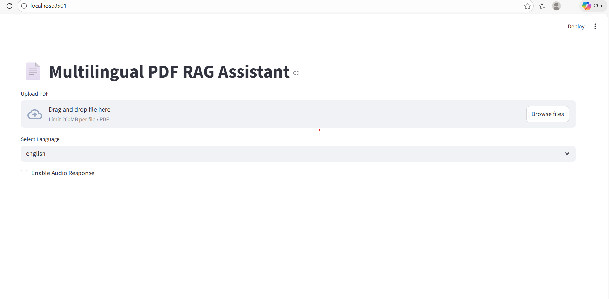
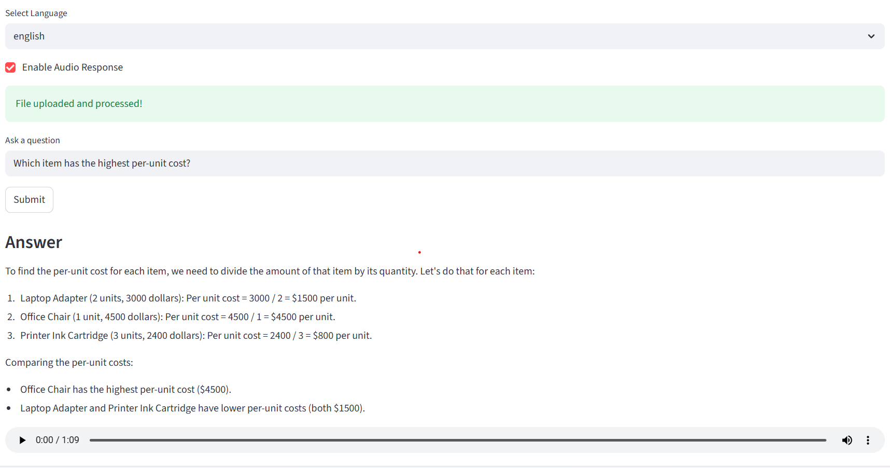
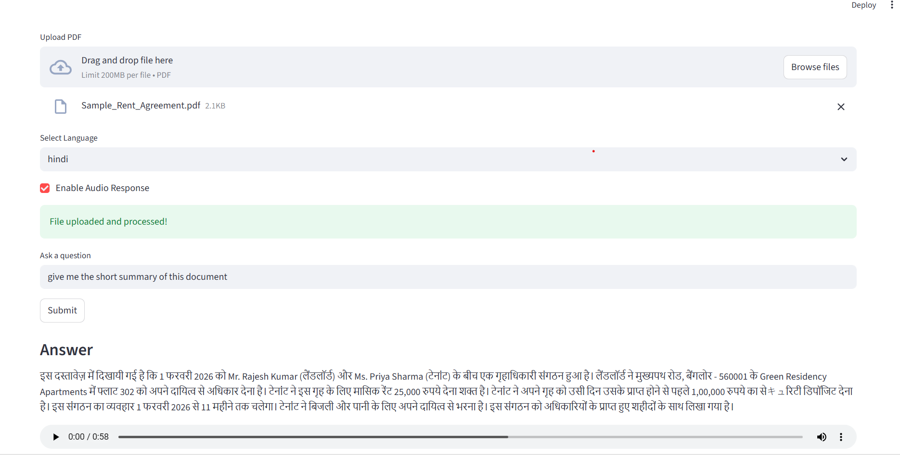

# 📄 Multilingual PDF RAG Assistant (FastAPI + Multilingual + OCR)

A **Retrieval-Augmented Generation (RAG)** based intelligent document assistant that allows users to upload PDF documents and ask context-aware questions in **English and Hindi**, with **optional audio responses**.

---

## 🌐 Project Overview

This project is designed to work with different types of documents, including:

- 📊 Structured documents (Bank Statements)
- 🧾 Semi-structured documents (Invoices)
- 📜 Unstructured documents (Agreements, Letters)

The system extracts text from PDFs, retrieves relevant context using vector embeddings, and generates **accurate, grounded answers** using a **local LLM (Mistral via Ollama)**.

---

## ⭐ Features

### 🔹 1. PDF Upload & Processing
- Upload PDF documents via Streamlit UI
- Native text extraction
- Table extraction
- OCR fallback for scanned PDFs

---

### 🔹 2. Intelligent Chunking & Embeddings
- Structure-aware chunking
- Vector embeddings using Sentence Transformers
- Persistent storage using ChromaDB

---

### 🔹 3. Context-Aware Question Answering (RAG)
Ask natural language questions such as:
- “What is the account holder name?”
- “What is the total balance?”
- “Is nominee information mentioned?”

Answers are:
- Strictly based on document content
- Hallucination-controlled
- Short and precise

---

### 🔹 4. Multilingual Support
- English question & answers
- Hindi question & answers
- Language-specific strict prompting

---

### 🔹 5. Optional Audio Responses
- Text-to-Speech output
- MP3 audio generated dynamically

---

## 🛠 Tech Stack

### Backend
- FastAPI
- ChromaDB
- Sentence Transformers
- pdfplumber
- pytesseract (OCR)
- Ollama (Mistral LLM)

### Frontend
- Streamlit

### AI Models
- all-MiniLM-L6-v2 (Embeddings)
- Mistral (LLM via Ollama)
- gTTS (Text-to-Speech)
- Helsinki-NLP Translation Models
  
---
## 🧠 System Architecture

The system follows a Retrieval-Augmented Generation (RAG) pipeline where
relevant document context is retrieved using vector similarity before generating
answers using a local large language model.

User  
⬇  
Streamlit Frontend  
⬇  
FastAPI Backend  
⬇  
PDF Processing (Native Text + OCR)  
⬇  
Text Chunking  
⬇  
Embedding (Sentence Transformers)  
⬇  
ChromaDB Vector Store  
⬇  
LLM (Mistral via Ollama)  
⬇  
Response Generation + Optional TTS  

---

## ▶️ How to Run the Project

1. Create and activate virtual environment  
2. Install dependencies using `requirements.txt`  
3. Start Ollama with Mistral model  
4. Run FastAPI backend  
5. Launch Streamlit frontend  

Refer to the commands in the repository for local execution.

---

## 📸 Screenshots

### Upload Interface

### Question Answering (English)

---

🔊 Audio responses are generated dynamically at runtime and are not stored in the repository.

### Question Answering (Hindi)

---

## 🧪 Example Use Cases

- Extract account details from bank statements
- Verify invoice totals and tax values
- Understand clauses in rent agreements
- Ask document questions in Hindi or English

---

| Feature                  | Implemented |
| ------------------------ | ----------- |
| PDF Upload               | ✅           |
| OCR Support              | ✅           |
| Intelligent Chunking     | ✅           |
| Semantic Search (RAG)    | ✅           |
| Multilingual Support     | ✅           |
| Strict Context Answering | ✅           |
| Audio Response           | ✅           |
| Persistent Vector DB     | ✅           |
| Local LLM Integration    | ✅           |

